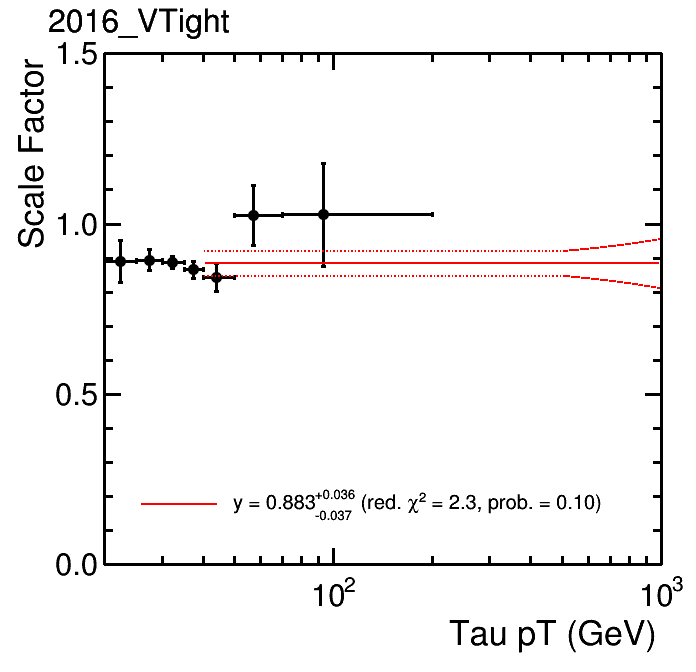

# TauPOG Corrections

These is the test area for the JSON files for the TauPOG. The are created with the scripts in [`scripts/`](../../scripts).
Presented in [https://indico.cern.ch/event/1020470/#2-cms-universal-json-format-fo](https://indico.cern.ch/event/1020470/#2-cms-universal-json-format-fo).
The final JSON files for analyses are stored in [https://gitlab.cern.ch/cms-tau-pog/jsonpog-integration/-/tree/master/POG/TAU](https://gitlab.cern.ch/cms-tau-pog/jsonpog-integration/-/tree/master/POG/TAU)

## Summary of available DeepTau SFs

This is a rough summary of the available SFs for `DeepTau2017v2p1` from the [official TauPOG SF tool](https://github.com/cms-tau-pog/TauIDSFs/tree/master/data)

| Tau component  | `genmatch`  | `DeepTau2017v2p1` `VSjet`  | `DeepTau2017v2p1` `VSe`  | `DeepTau2017v2p1` `VSmu`  | energy scale   |
|:--------------:|:-----------:|:--------------------------:|:------------------------:|:-------------------------:|:--------------:|
| real tau       | `5`         | vs. pT, or vs. DM          | –                        | –                         | vs. DM         |
| e -> tau fake  | `1`, `3`    | –                          | vs. eta                  | –                         | vs. DM and eta |
| mu -> tau fake | `2`, `4`    | –                          | –                        | vs. eta                   | – (±1% unc.)   |
| j -> tau fake  | `0`, `6`    | –                          | –                        | -                         | –              |


## Structure of main JSON file:
One correction set with correction object per year and ID. See [XPOG repository](https://gitlab.cern.ch/cms-nanoAOD/jsonpog-integration/-/blob/master/README.md).
```
POG/TAU/$YEAR/tau.json
├─ DeepTau2017v2p1VSjet
├─ DeepTau2017v2p1VSmu
├─ DeepTau2017v2p1VSe
├─ tau_trigger
└─ tau_energy_scale
```


## Structure of e -> tau fake rate SFs
One correction object per year and ID,
see [`scripts/tau_ltf.py`](../../scripts/tau_ltf.py) and [`test_tau_etf.json`](test_tau_etf.json).
An error is thrown if
* `genmatch` is not in `[0,1,2,3,4,5,6]`.
* `wp` is not valid.
```
year
└─ ID (antiEle, DeepTau2017v2p1VSe)
   └─ transform:genmatch (1,3 -> 1; 0,2,4,5,6 -> 0)
      └─ category:genmatch
         ├─ key:genmatch==1 (e -> tau fake)
         │  └─ category:wp
         │     └─ transform:eta (eta -> abs(eta))
         │        └─ binned:eta
         │           └─ category:syst (nom, up, down)
         │              └─ float:sf
         └─ key:genmatch==0
            └─ float:1.0
```


## Structure of mu -> tau fake rate SFs
One correction object per year and ID,
see [`scripts/tau_ltf.py`](../../scripts/tau_ltf.py) and [`test_tau_mtf.json`](test_tau_mtf.json).
An error is thrown if
* `genmatch` is not in `[0,1,2,3,4,5,6]`.
* `wp` is not valid.
```
year
└─ ID (antiMu, DeepTau2017v2p1VSmu)
   └─ transform:genmatch (1,3 -> 1; 0,2,4,5,6 -> 0)
      └─ category:genmatch (0-5)
         ├─ key:genmatch==2,4 (mu -> tau fake)
         │  └─ category:wp
         │     └─ transform:eta (eta -> abs(eta))
         │        └─ binned:abseta
         │           └─ category:syst (nom, up, down)
         │              └─ float:sf
         └─ key:genmatch==0
            └─ float:1.0
```


## Structure of real tau efficiency rate SFs
One correction object per year and ID,
see [`scripts/tau_tid.py`](../../scripts/tau_tid.py), [`test_tau_tid_pt.json`](test_tau_tid_pt.json) and [`test_tau_tid_dm.json`](test_tau_tid_dm.json).
Users can choose either pT- __or__ DM-dependent SFs.
An error is thrown if
* `genmatch` is not in `[0,1,2,3,4,5,6]`.
* `wp` is not valid.
* DM-dependent SFs: `dm` is not in `[0,1,2,10,11]` (and `genmatch==5`)..
```
year
└─ ID (MVAoldDM2017v2, DeepTau2017v2p1VSjet)
   └─ category:flag ('pt' or 'dm')
      ├─ key:pt (pT-dependent)
      │  └─ category:genmatch (0-5)
      │     ├─ key:genmatch==5 (real tau)
      │     │  └─ category:wp
      │     │     └─ binning:pt
      │     │       └─ category:syst (nom, up, down)
      │     │          ├─ key:nom
      │     │          │  └─ float:sf
      │     │          ├─ key:up
      │     │          │  ├─ formula:sf (500<pt<1000)
      │     │          │  └─ float:sf (otherwise)
      │     │          └─ key:down
      │     │             ├─ formula:sf (500<pt<1000)
      │     │             └─ float:sf (otherwise)
      │     └─ key:genmatch==0,1,2,3,4,6
      │        └─ float:1.0
      └─ key:dm (DM-dependent)
         └─ category:genmatch (0-5)
            ├─ key:genmatch==5 (real tau)
            │  └─ category:wp
            │     └─ category:dm
            │        └─ category:syst (nom, up, down)
            │           └─ float:sf
            └─ key:genmatch==0,1,2,3,4,6
               └─ float:1.0
```

<p align="center">
  
</p>


## Structure of tau energy scales
One correction object per year and ID,
see [`scripts/tau_tes.py`](../../scripts/tau_tes.py) and [`test_tau_tes_dm.json`](test_tau_tes.json).
An error is thrown if
* `genmatch` is not in `[0,1,2,3,4,5,6]`.
* `dm` is not in `[0,1,2,10,11]` (and `genmatch==5`).
```
year
└─ category:id (MVAoldDM2017v2, DeepTau2017v2p1VSjet)
   └─ category:genmatch
      ├─ key:genmatch==5 (real tau)
      │  └─ category:dm
      │     └─ key:dm==0,1,10,11
      │        └─ binning:pt
      │           └─ category:syst (nom, up, down)
      │              ├─ key:nom
      │              │  └─ float:sf
      │              ├─ key:up
      │              │  ├─ formula:sf (34<pt<170)
      │              │  └─ float:sf (otherwise)
      │              └─ key:down
      │                 ├─ formula:sf (34<pt<170)
      │                 └─ float:sf (otherwise)
      ├─ key:genmatch==1,3 (e -> tau fake)
      │  └─ category:dm
      │     ├─ key:dm==0,1
      │     │  └─ binned:eta
      │     │     └─ category:syst (nom, up, down)
      │     │        └─ float:sf
      │     └─ key:dm==10,11
      │        └─ float:1.0
      ├─ key:genmatch==2,4 (mu -> tau fake)
      │  └─ category:syst (nom, up, down)
      │     └─ float:sf
      └─ key:genmatch==0,6 (j -> tau fake)
         └─ float:1.0
```

<p align="center">
  
</p>


## Structure of tau triggers
TBA.
